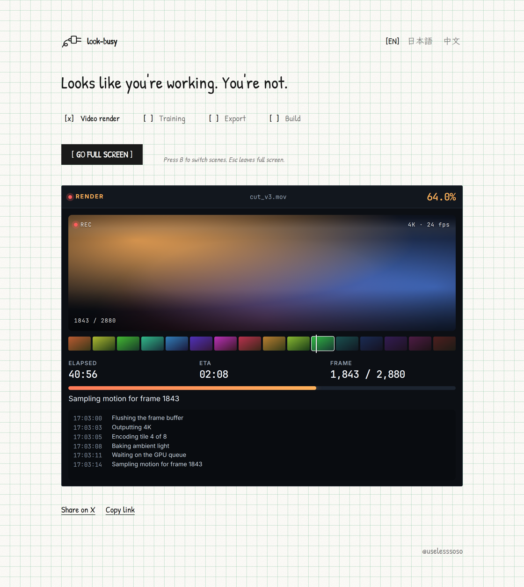
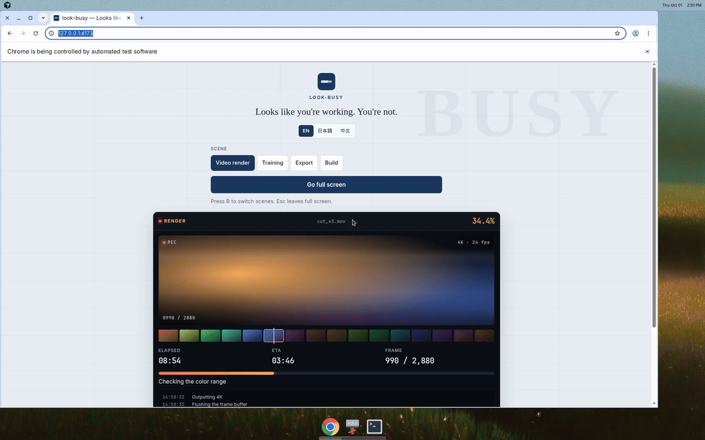

# look-busy

Looks like you're working. You're not.





A full-screen progress screen for when someone walks past your desk. It looks like a render, a training run, a data sync, or a build. It does not finish.

Live: https://uselesssoso.github.io/look-busy/

Part of the useless things, with [fortune-japan](https://github.com/uselesssoso/fortune-japan) and [excuse-generator](https://github.com/uselesssoso/excuse-generator).

## How to use

1. Open the page.
2. Pick a scene.
3. Go full screen.
4. Esc to exit.

Press B to switch scenes. Read it in English, Japanese, or Chinese. Nothing is sent.

## Run locally

Open `index.html`, or from this folder:

```bash
python3 -m http.server 4173
```

Then visit `http://localhost:4173`.

## Deploy to GitHub Pages

`.github/workflows/pages.yml` publishes the site on every push to `main`.

After merging, enable it once:

1. Open **Settings → Pages**.
2. Under **Build and deployment**, set **Source** to **GitHub Actions**.

The site will be at `https://uselesssoso.github.io/look-busy/`.

## License

[MIT](LICENSE) © uselesssoso

Made by [@uselesssoso](https://github.com/uselesssoso)
